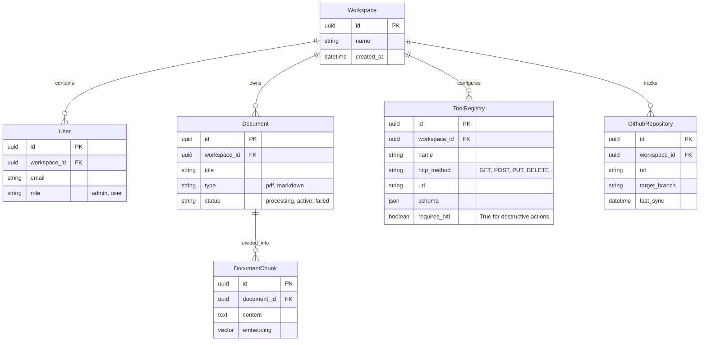

# 02 Database Schema

## Document Metadata
- **Status:** Approved
- **Scope:** Forward-Looking (Supports MVP & V1)
- **ORM:** SQLModel (PostgreSQL)
- **Last Updated:** 2026-08-23

---

## 1. Schema Overview

This schema is designed to be multi-tenant (using `workspace_id` on all core tables) and forward-looking. We are establishing the structure for V1 features (like GitHub Repositories) now, even though we will only implement the backend logic for them in Phase 2.

## 2. Table Definitions (SQLModel Implementation Notes)

### 2.1. `Workspace`
The root tenant for a business utilizing the A²I platform.
- Every subsequent table (except users mapping to it) *must* contain a `workspace_id` to ensure strict tenant isolation during queries.

### 2.2. `Document` & `DocumentChunk` (MVP)
- **`Document`**: Tracks the metadata of the uploaded file. The `status` field is critical for the UI to display the "Processing" (Yellow) or "Active" (Green) badges.
- **`DocumentChunk`**: Utilizes the `pgvector` extension. The `embedding` column will store floats (typically dimension 1536 for OpenAI models).

### 2.3. `ToolRegistry` (MVP)
- Stores the developer configurations for agent tools. 
- The `schema` column uses PostgreSQL's native `JSONB` to store the strict API parameters.
- The `requires_hitl` boolean is the hard-lock security measure preventing LLMs from executing destructive actions without the user clicking the "Confirm" button in the widget.

### 2.4. `GithubRepository` (V1 - Forward Looking)
- Established now to prevent future database migrations.
- Used in Phase 2 to automatically trigger knowledge-base re-indexing when a developer pushes code to the `target_branch`.
